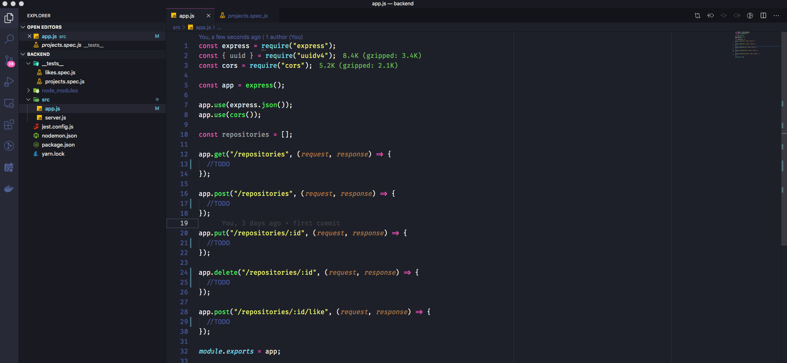

<h3 align="center">
  Desafio 02: Conceitos do Node.js
</h3>

“Não espere para plantar, apenas tenha paciência para colher”!</blockquote>

  

  

  

  

  <a href="#rocket-sobre-o-desafio">Sobre o desafio</a>&nbsp;&nbsp;&nbsp;|&nbsp;&nbsp;&nbsp;
  <a href="#calendar-entrega">Entrega</a>

## :rocket: Sobre o desafio

Nesse desafio, você deve criar uma aplicação para treinar o que você aprendeu até agora no Node.js!

Essa será uma aplicação para armazenar repositórios do seu portfólio, que irá permitir a criação, listagem, atualização e remoção dos repositórios, e além disso permitir que os repositórios possam receber "likes".

### Template da aplicação

Para te ajudar nesse desafio, criamos para você um modelo que você pode clonar através do github.

Você deve fazer um fork do seguinte template para realizar o desafio: **[Acessar Template](https://github.com/Rocketseat/gostack-template-conceitos-nodejs)**

**Dica**: Caso não saiba como fazer o fork de um projeto, temos um guia em **[nosso FAQ](https://github.com/Rocketseat/bootcamp-gostack-desafios/tree/master/faq-desafios).**

Agora navegue até a pasta criada e abra no Visual Studio Code, e você terá algo parecido com isso:

  

### Rotas da aplicação

Agora que você já está com o template clonado, e pronto para continuar, você deve abrir o arquivo app.js, e completar onde não possui código com o código para atingir os objetivos de cada rota.

- **`POST /repositories`**: A rota deve receber `title`, `url` e `techs` dentro do corpo da requisição, sendo a URL o link para o github desse repositório. Ao cadastrar um novo projeto, ele deve ser armazenado dentro de um objeto no seguinte formato: `{ id: "uuid", title: 'Desafio Node.js', techs: ["Node.js", "..."], likes: 0 }`; Certifique-se que o ID seja um UUID, e de sempre iniciar os likes como 0.

- **`GET /repositories`**: Rota que lista todos os repositórios;

- **`PUT /repositories/:id`**: A rota deve alterar apenas o `título`, a `url` e as `techs` do repositório que possua o `id` igual ao `id` presente nos parâmetros da rota;

- **`DELETE /repositories/:id`**: A rota deve deletar o repositório com o `id` presente nos parâmetros da rota;

- **`POST /repositories/:id/like`**: A rota deve aumentar o número de likes do repositório específico escolhido através do `id` presente nos parâmetros da rota, a cada chamada dessa rota, o número de likes deve ser aumentado em 1;

### Específicação dos testes

Em cada teste, tem uma breve descrição no que sua aplicação deve cumprir para que o teste passe.

Caso você tenha dúvidas quanto ao que são os testes, e como interpretá-los, dé uma olhada em **[nosso FAQ](https://github.com/Rocketseat/bootcamp-gostack-desafios/tree/master/faq-desafios).**

Para esse desafio temos os seguintes testes:

- **`should be able to create a new repository`**: Para que esse teste passe, sua aplicação deve permitir que um repositório seja criado, e retorne um json com o projeto criado.

- **`should be able to list the repositories`**: Para que esse teste passe, sua aplicação deve permitir que seja retornado um array com todos os repositórios que foram criados até o momento.

- **`should be able to update repository`**: Para que esse teste passe, sua aplicação deve permitir que sejam alterados apenas os campos `url`, `title` e `techs`.

- **`should not be able to update a repository that does not exist`**: Para que esse teste passe, você deve validar na sua rota de update se o id do repositório enviado pela url existe ou não. Caso não exista, retornar um erro com status `400`.

- **`should not be able to update repository likes manually`**: Para que esse teste passe, você não deve permitir que sua rota de update altere diretamente os likes desse repositório, mantendo o mesmo número de likes que o repositório já possuia antes da atualização. Isso porque o único lugar que deve atualizar essa informação é a rota de responsável por aumentar o número de likes.

- **`should be able to delete the repository`**: Para que esse teste passe, você deve perimtir que a sua rota de delete excluia um projeto, e ao fazer a exclusão, ele retorne uma resposta vazia, com status `204`.

- **`should not be able to delete a repository that does not exist`**: Para que esse teste passe, você deve validar na sua rota de delete se o id do repositório enviado pela url existe ou não. Caso não exista, retornar um erro com status `400`.

- **`should be able to give a like to the repository`**: Para que esse teste passe, sua aplicação deve permitir que um repositório com o id informado possa receber likes. O valor de likes deve ser incrementado em 1 a cada requisição.

- **`should not be able to like a repository that does not exist`**: Para que esse teste passe, você deve validar na sua rota de like se o id do repositório enviado pela url existe ou não. Caso não exista, retornar um erro com status `400`.

## :calendar: Entrega

Esse desafio deve ser entregue a partir da plataforma Skylab, envie o link do repositório que você fez o fork com suas alterações. Após concluir o desafio, fazer um post no Linkedin e postar o código no Github é uma boa forma de demonstrar seus conhecimentos e esforços para evoluir na sua carreira para oportunidades futuras.

---

Feito com ♥ by PitzTech com a tutoria de [Diego Fernandes](https://github.com/diego3g) :wave:

  
  &nbsp;&nbsp;&nbsp;&nbsp;
  
  &nbsp;&nbsp;&nbsp;&nbsp;
  

Apoio da [Rocketseat](https://discord.com/invite/gCRAFhc)
